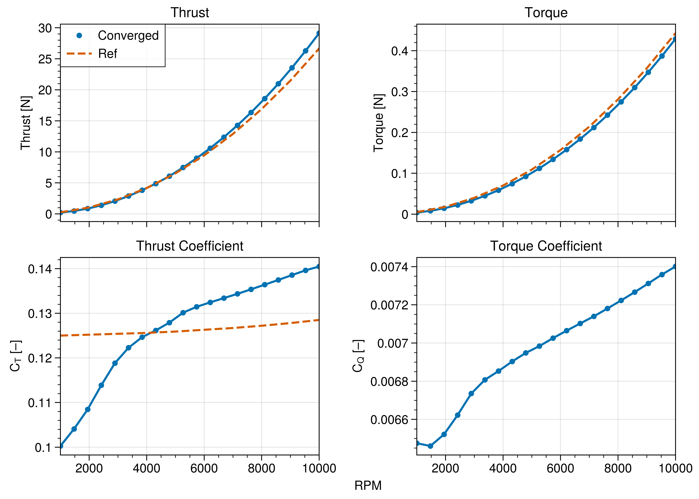
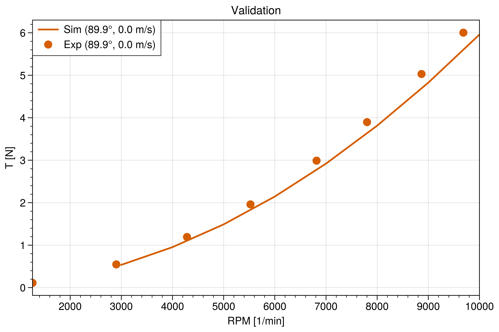
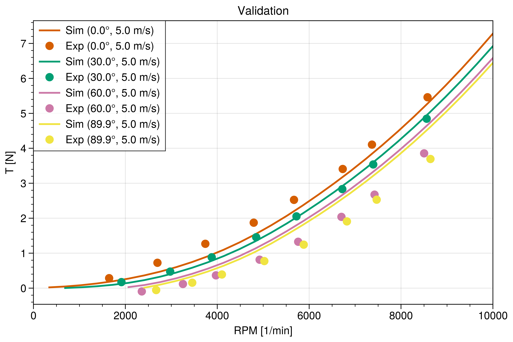
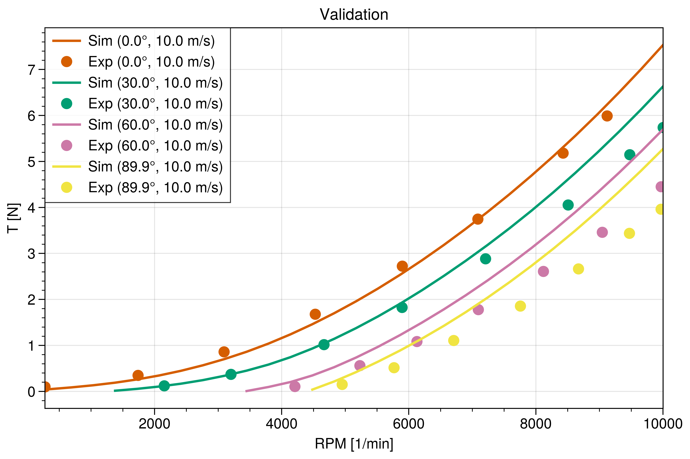
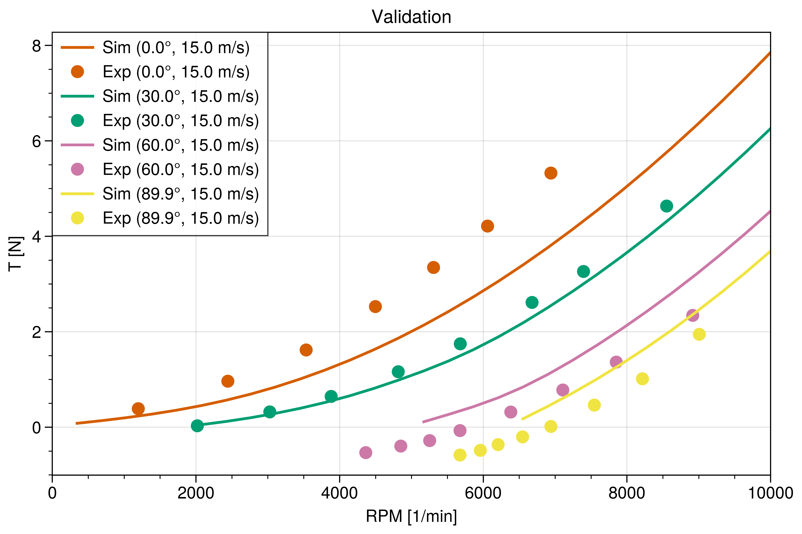
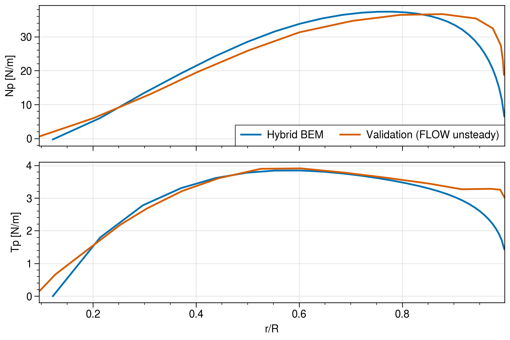
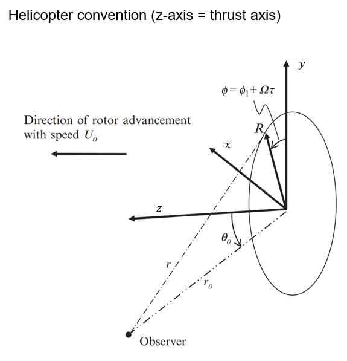
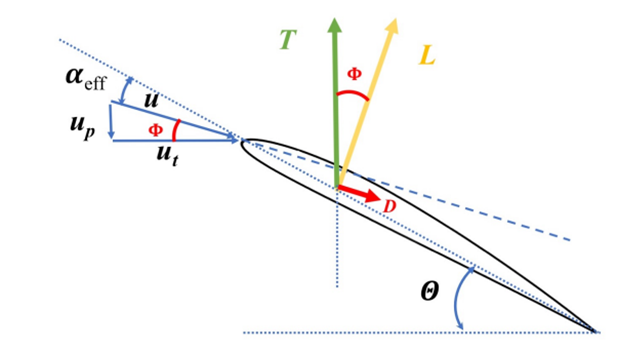

# Propeller

- Julia implementation of Davoudi's [1] hybrid blade element momentum (BEM) model
- Linear inflow (default: Pitt-Peters) model coupled with BEM
- Multi-threaded (if Julia is started with multiple threads)
- Corrections:
  - Hub/tip-loss correction by Prandtl [2]
  - Mach correction of polars by Glauert (note: use polar data generated at $M=0.0$ for accurate correction)
  - Rotational 3D correction for polars (offline, online)

## Installation

```bash
# Add non-listed Packages
import Pkg
url = "https://github.com/christianhauschel/"
packages = (
    ("PrettySections.jl", nothing),
    ("AirfoilFast.jl", nothing),
    ("AirfoilPolars.jl", nothing),
    ("Gradient.jl", nothing),
    ("FlightConditions.jl", nothing),
    ("GeometricTools.jl", nothing),
    ("GridSpacing.jl", nothing),
    ("Propeller.jl", nothing),
)
Pkg.add([Pkg.PackageSpec(; url=url * name, rev=v) for (name, v) in packages])
```

## Usage

```bash
julia --threads=4
julia> include("example.jl")
```


## Useful Scripts

- `rotor_calculations.jl`: make different calculations a priori, e.g. to figure out the approx. Reynolds number range for the polar calculation
- `misc/export_dust.jl`: exports rotor to dust geometry input file
- `misc/export_flowunsteady.jl`: exports rotor to FLOWUnsteady


## Validation

<!-- ### Sanity Check

- High velocity in +z-direction ("vortex ring state") → leads to non-convergence
- Higher RPM → higher induced velocity → the convergence improves again
- Higher velocity in +z-direction → higher thrust
- Higher velocity in -z-direction → lower thrust -->

### Test Cases

Simple comparison with uniform inflow (APC11x47):
</img>

#### Comparison with Measurements

Data taken from Davoudi [1]:

</img>
</img>
</img>
</img>


### Normal and Tangential Loads / Span

Comparison to FLOWUnsteady BEM code:

</img>

## Conventions

</img>

</img>

## References

1. B. Davoudi, “A Hybrid Blade Element Momentum Model for Flight Simulation of Rotary Wing Unmanned Aerial Vehicles,” AIAA Paper, 2019.
2. <https://flow.byu.edu/FLOWUnsteady/examples/rotorhover-aero/>
