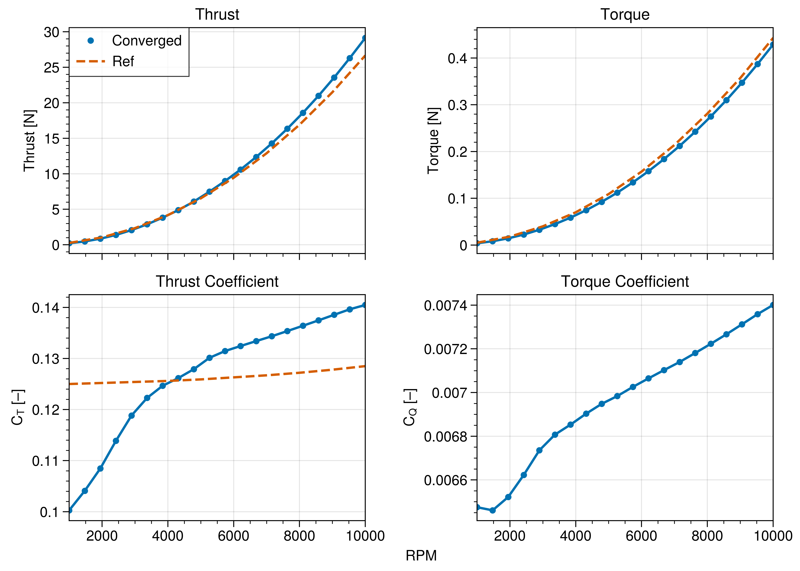
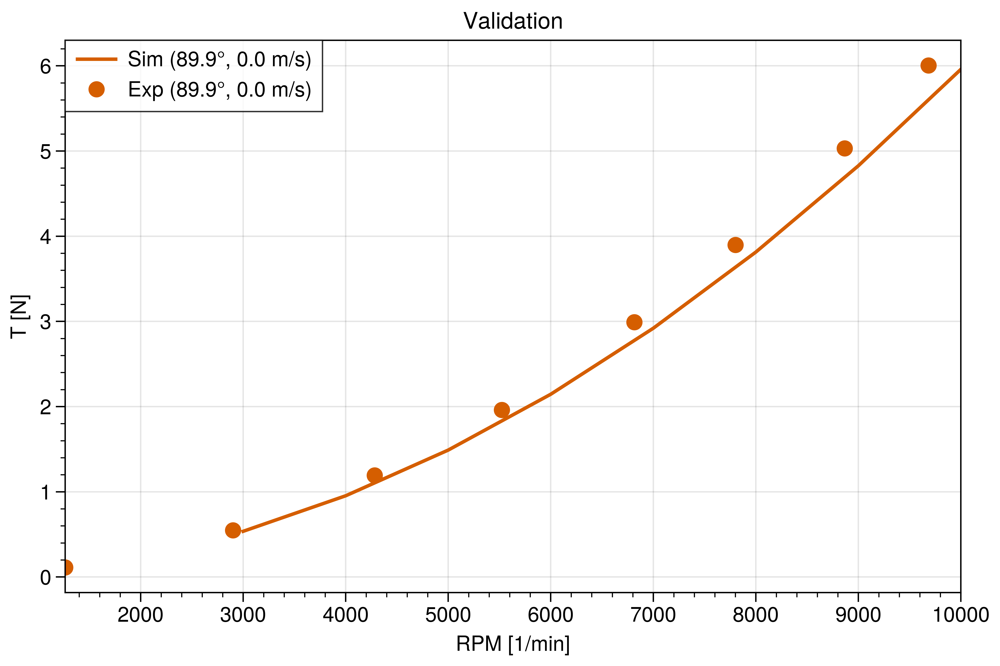
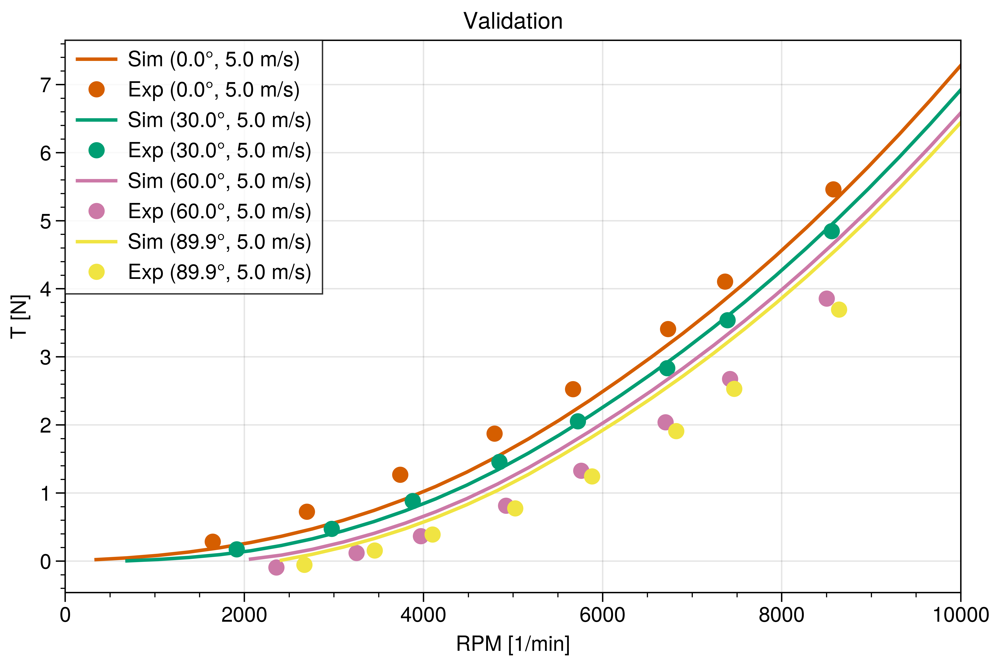
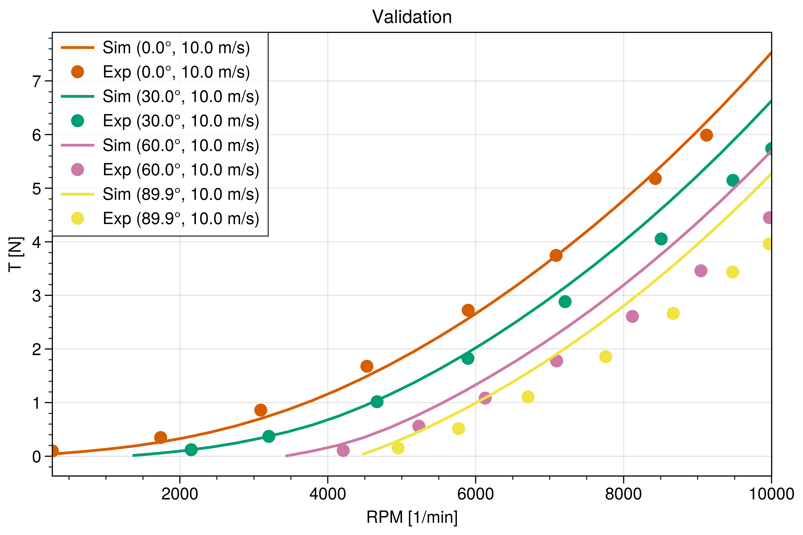
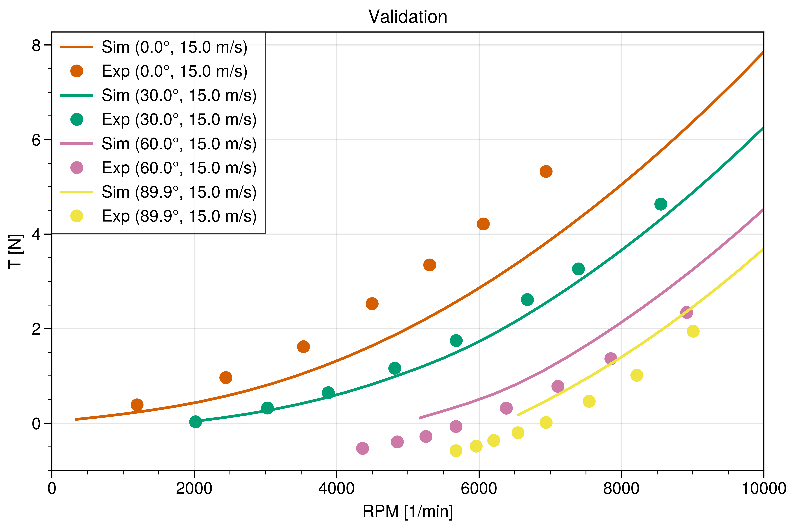
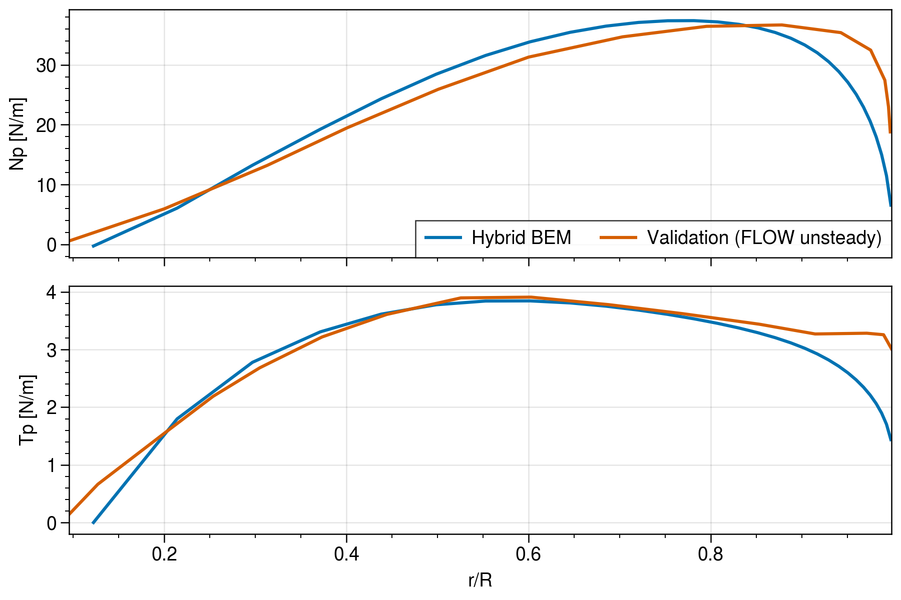
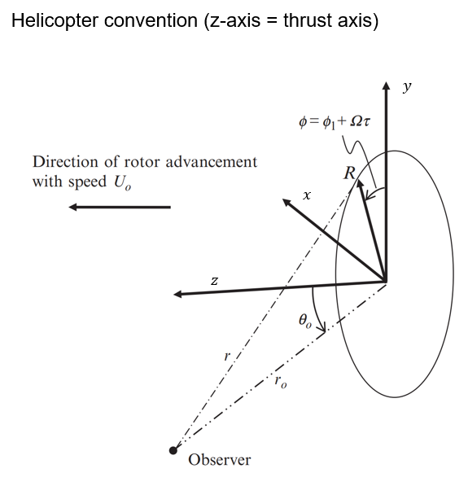
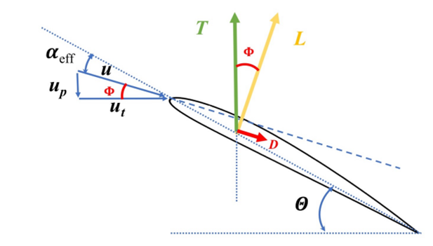

# Propeller.jl

Julia implementation of a hybrid blade element momentum (BEM) propeller model based on Davoudi [1].

The model supports:

- Linear inflow coupled with BEM, using Pitt-Peters by default
- Multi-threaded sweeps when Julia is started with multiple threads
- Prandtl hub/tip-loss correction [2]
- Glauert Mach correction for polar data
- Offline and online rotational 3D polar correction
- Export helpers for DUST and FLOWUnsteady workflows

## Repository Layout

- `src/`: package implementation
- `config/rotor/`: rotor YAML files and source geometry data
- `data/airfoils/`: airfoil coordinate data
- `data/polars/`: polar CSV data
- `example.jl`: small RPM sweep example
- `rotor_calculations.jl`: pre-calculation helper, for example Reynolds number estimates
- `validation/`: validation scripts and reference data
- `misc/`: export and data-generation utilities
- `test/`: package tests

## Installation

Install Julia, Git, and Conda or Miniconda first. Run all project commands from the repository root unless noted otherwise.

On Windows PowerShell:

```powershell
git clone https://github.com/christianhauschel/Propeller.jl C:\path\to\Propeller.jl
Set-Location C:\path\to\Propeller.jl
julia --project=.
```

If the repository is already on a mapped drive, use the normal Windows path:

```powershell
Set-Location P:\code\09_aero\Propeller.jl
julia --project=.
```

On Linux/macOS:

```bash
git clone https://github.com/christianhauschel/Propeller.jl <mypath>
cd <mypath>
julia --project=.
```

In the Julia REPL, instantiate the project:

```julia
import Pkg
Pkg.instantiate()
```

This repository contains a `Manifest.toml`, so `Pkg.instantiate()` is the preferred path. If Julia cannot resolve the private/unregistered dependencies, add them by URL:

```julia
import Pkg

url = "https://github.com/christianhauschel/"
packages = [
    "AirfoilPolars.jl",
    "AirfoilFast.jl",
    "PrettySections.jl",
    "Gradient.jl",
    "FlightConditions.jl",
    "GeometricTools.jl",
    "GridSpacing.jl",
]

Pkg.add([Pkg.PackageSpec(url=url * p) for p in packages])
Pkg.instantiate()
```

`AirfoilPolars.jl` must be available before `AirfoilFast.jl`, because `AirfoilFast.jl` depends on it.

## Python Plotting Setup

Some examples and validation scripts use Python plotting through `PyCall` and `ultraplot`.

Create a Python environment.

On Windows PowerShell:

```powershell
conda create -n julia python=3.10
conda activate julia
python -m pip install ultraplot
where python
```

Use the Python path inside the `julia` environment. It usually looks like:

```text
C:\Users\<user>\AppData\Local\miniconda3\envs\julia\python.exe
```

If `conda activate julia` is not recognized in PowerShell, run once:

```powershell
conda init powershell
```

Then close and reopen PowerShell.

On Linux/macOS:

```bash
conda create -n julia python=3.10
conda activate julia
python -m pip install ultraplot
which python
```

Configure `PyCall` from Julia:

```julia
import Pkg
Pkg.add("PyCall")
ENV["PYTHON"] = raw"C:\Users\<user>\AppData\Local\miniconda3\envs\julia\python.exe"
Pkg.build("PyCall")
```

On Linux/macOS, use the path returned by `which python`:

```julia
import Pkg
Pkg.add("PyCall")
ENV["PYTHON"] = "/home/<user>/miniconda3/envs/julia/bin/python"
Pkg.build("PyCall")
```

Restart Julia, then test:

```julia
using PyCall
pyversion
uplt = pyimport("ultraplot")
```

## Running The Example

From the repository root:

```bash
julia --project=. example.jl
```

Or from the Julia REPL:

```julia
include("example.jl")
```

For threaded runs:

```bash
julia --threads=4 --project=. example.jl
```

The default example uses:

```julia
name_rotor = "apc_11x47SF"
```

which loads:

```text
config/rotor/apc_11x47SF.yaml
```

Plots and generated files are written below `out/`.

## Rotor Configurations

Available rotor YAML configs include:

- `apc_11x47SF.yaml`
- `apc_845MR.yaml`
- `apc_845MR_model.yaml`
- `davoudi.yaml`
- `dji9443.yaml`
- `djimatrice300rtk.yaml`
- `rotor_anopp.yaml`
- `rotor_simple.yaml`
- `test.yaml`

When changing scripts, set `name_rotor` to the YAML filename without `.yaml`. For example:

```julia
name_rotor = "dji9443"
```

not `dji_9443`, because `config/rotor/dji_9443/` is a data directory, not a YAML config file.

## Useful Scripts

- `example.jl`: runs an RPM sweep and optionally plots thrust, torque, `C_T`, and `C_Q`
- `rotor_calculations.jl`: estimates Reynolds number, Mach number, and velocity ranges for a rotor
- `validation/apc11x47.jl`: APC 11x4.7 static validation sweep
- `validation/davoudi.jl`: comparison against Davoudi reference data
- `validation/loading.jl`: normal and tangential loading comparison
- `validation/polarmodel.jl`: compares model polars against polar data
- `misc/export_dust.jl`: exports a rotor blade geometry for DUST
- `misc/export_flowunsteady.jl`: exports rotor data for FLOWUnsteady
- `misc/generate_training.jl`: generates training samples and writes `trainingdata.csv`
- `misc/airfoil_csv2dat.jl`: converts airfoil CSV data to DAT-style files

Most scripts have settings near the top. Edit `name_rotor`, RPM ranges, plotting flags, and output folders there.

## Tests

Run the package tests with:

```bash
julia --project=. -e "import Pkg; Pkg.test()"
```

## Troubleshooting

If Julia cannot find a config file, check that you are in the repo root:

```julia
pwd()
readdir("config/rotor")
```

If `build("PyCall")` fails with `build not defined`, use:

```julia
import Pkg
Pkg.build("PyCall")
```

If `pyversion` is not defined, load `PyCall` first:

```julia
using PyCall
pyversion
```

If `using PyCall` fails because Python cannot import `ctypes`, verify the Python environment outside Julia:

```bash
conda activate julia
python -c "import ctypes; print('ctypes ok')"
conda install -y libffi
```

Then rebuild `PyCall` and restart Julia.

## Validation

### APC 11x4.7 Static Case

Simple comparison with uniform inflow:

</img>

### Davoudi Measurements

Data taken from Davoudi [1]:

</img>
</img>
</img>
</img>

### Normal And Tangential Loads

Comparison to FLOWUnsteady BEM code:

</img>

## Conventions

</img>

</img>

## References

1. B. Davoudi, "A Hybrid Blade Element Momentum Model for Flight Simulation of Rotary Wing Unmanned Aerial Vehicles," AIAA Paper, 2019.
2. <https://flow.byu.edu/FLOWUnsteady/examples/rotorhover-aero/>
